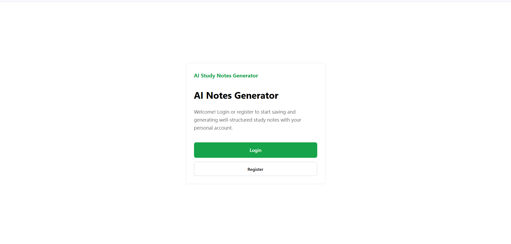
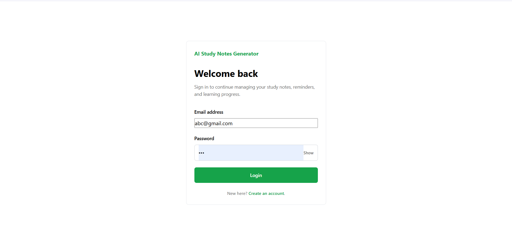
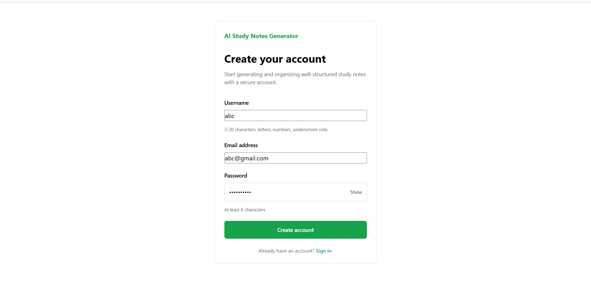

# AI Study Notes Generator

## Overview

AI Study Notes Generator is an AI-powered web application designed to help students create clear and beginner-friendly study notes on any topic. Users can register, log in securely, generate notes using a local Large Language Model (LLM), save generated notes, search previous notes, and manage their study materials through a simple and responsive interface.

The application is developed using Flask for the backend, SQLite for database management, and Ollama with the Gemma 3 model for AI-powered note generation.

---

## Features

* User registration and secure login
* Password hashing for secure authentication
* AI-powered study note generation
* Save generated notes
* Search previously generated notes
* Delete saved notes
* SQLite database integration
* Responsive web interface
* Local AI integration using Ollama

---

## Website Pages

## Screenshots

### Home Page



### Login Page



### Register Page



### Dashboard


### AI Generated Notes


---

## Technologies Used

### Frontend

* HTML
* CSS
* JavaScript

### Backend

* Python
* Flask

### Database

* SQLite

### Artificial Intelligence

* Ollama
* Gemma 3 (1B)

### Development Tools

* Visual Studio Code
* Git
* GitHub

---

## Project Structure

```text
AI-Study-Notes-Generator/
│
├── app.py
├── database.db
├── requirements.txt
├── README.md
├── .gitignore
├── static/
│   ├── style.css
│   └── script.js
├── templates/
│   ├── home.html
│   ├── login.html
│   ├── register.html
│   └── dashboard.html
```

---

## Installation

### Clone the repository

```bash
git clone https://github.com/sarigasreekala90-wq/AI-Study-Notes-Generator.git
```

### Move into the project directory

```bash
cd AI-Study-Notes-Generator
```

### Install the required packages

```bash
pip install -r requirements.txt
```

### Install Ollama

Download and install Ollama from the official website.

### Download the AI model

```bash
ollama pull gemma3:1b
```

### Start the Ollama server

```bash
ollama serve
```

If you receive the message:

```text
Error: listen tcp 127.0.0.1:11434: bind: Only one usage of each socket address...
```

it means the Ollama server is already running, so you can continue.

### Run the application

```bash
python app.py
```

### Open the website

Visit:

```text
http://127.0.0.1:5000
```

---

## Future Enhancements

* Export notes as PDF
* AI Chat Assistant
* Flashcard Generator
* Quiz Generator
* Voice Input
* Dark Mode
* Study Progress Dashboard
* Note Categories
* Download Notes

---

## Author

Sariga

B.Tech Information Technology Student

---

## License

This project is intended for educational and learning purposes.
